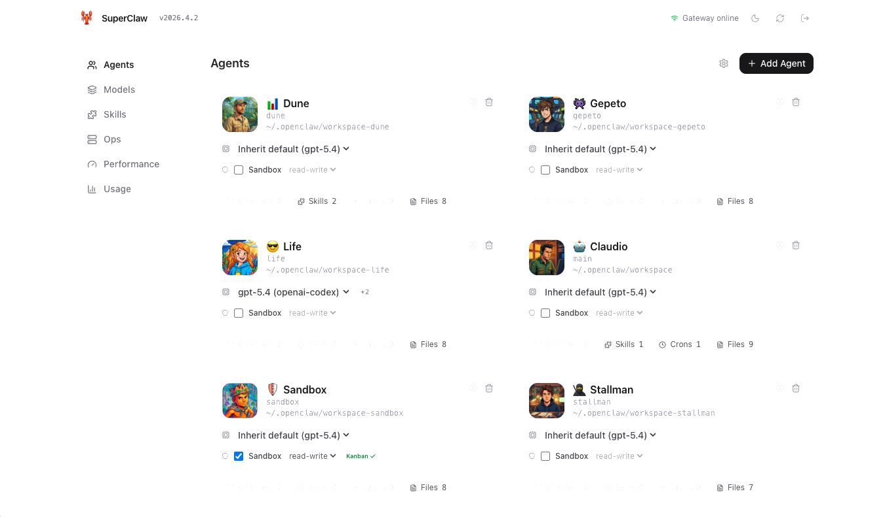
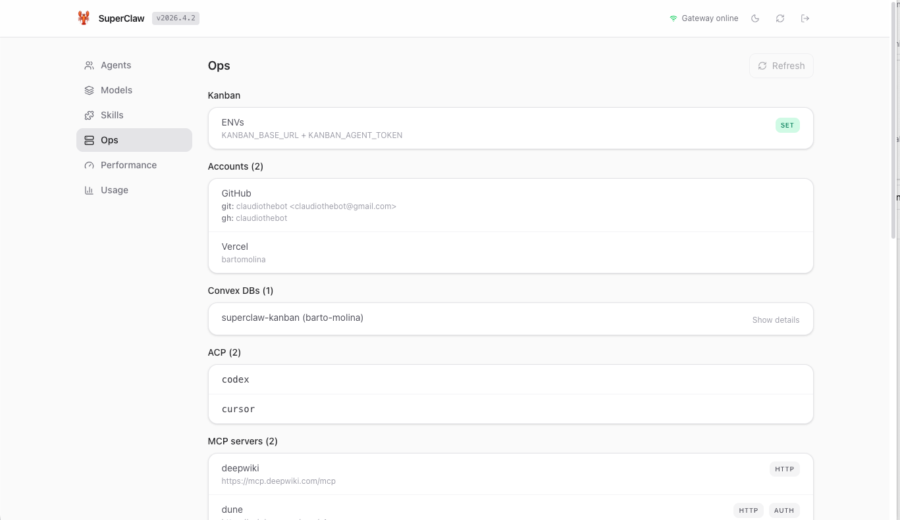
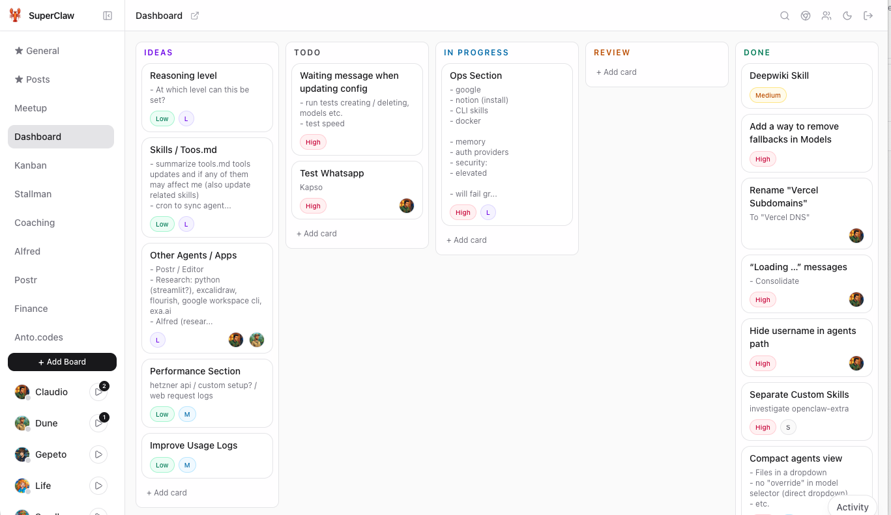

# 🦞 SuperClaw — Companion suite for OpenClaw

<p align="center">
  
</p>

<p align="center">
  <strong>Dashboard, Kanban, and browser extension for running OpenClaw day to day.</strong>
</p>

**SuperClaw** is the local companion suite for [OpenClaw](https://github.com/openclaw/openclaw).
It gives you a dashboard for managing agents and seeing useful info from your VPS, plus a Kanban app for coordinating work between agents and humans.

<p align="center">
  <a href="./INSTALL.md">Install</a> · <a href="./dashboard/README.md">Dashboard docs</a> · <a href="./kanban/README.md">Kanban docs</a> · <a href="./extension/README.md">Extension docs</a> · <a href="./LICENSE">License</a>
</p>

<table>
  <tr>
    <td align="center" width="33.33%">
      <br>
      <sub><strong>Dashboard · Agents</strong></sub>
    </td>
    <td align="center" width="33.33%">
      <br>
      <sub><strong>Dashboard · Ops</strong></sub>
    </td>
    <td align="center" width="33.33%">
      <br>
      <sub><strong>Kanban</strong></sub>
    </td>
  </tr>
</table>

## Requirements

- **[Convex](https://www.convex.dev/)** — remote backend/database for Kanban tasks, boards, and workflow state
- **[Resend](https://resend.com/)** — for Kanban auth emails

### Optional

- **[Gemini API key](https://aistudio.google.com/)** — optional for dashboard avatar generation during the agent creation flow
- **[Cloudflare Tunnel](https://developers.cloudflare.com/cloudflare-one/connections/connect-networks/)** — recommended for exposing/managing apps cleanly

## Installation

SuperClaw will install the suite into your main OpenClaw workspace:

```text
~/.openclaw/workspace/
├── apps/
│   └── superclaw/
│       ├── dashboard/
│       ├── kanban/
│       └── extension/
└── skills/
    ├── superclaw/
    └── kanban/
```

Take a look at [`INSTALL.md`](./INSTALL.md), or point your OpenClaw agent at it and have it run the setup for you.
